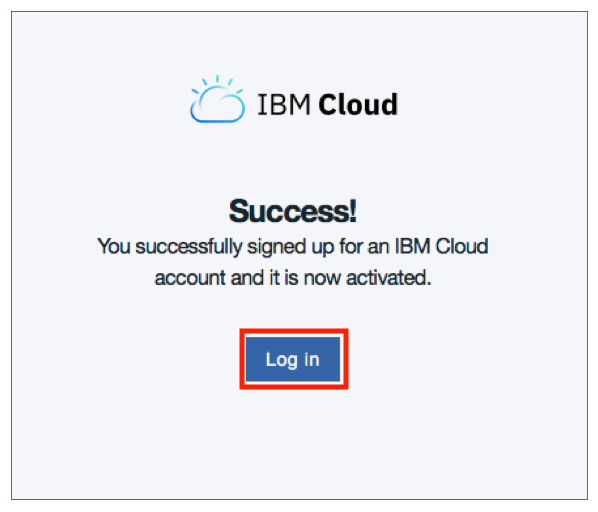
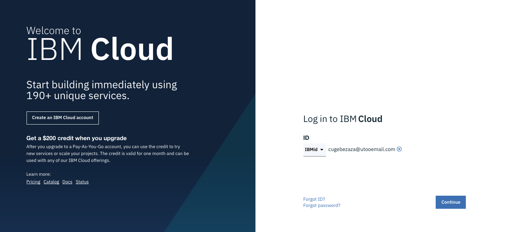
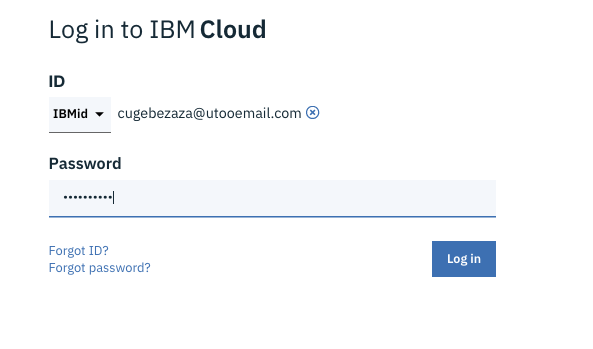

# IBM Hybrid Cloud Workshop
---
# Preparing the labs
---


Before you can run all the labs about container orchestration, you should prepare your environment to execute those labs. Check the following instructions.

Labs are running on the **IBM Cloud** (ex Bluemix) and **IBM Cloud Private**.


# Task 1. IBM Cloud registration

**<u>Skip This task if you already have an IBM cloud account</u>** 

So before you can start any labs, you should have satisfied the following prerequisites :
- [ ] You should have **1 valid email** 

- [ ] Sign up to the **IBM Cloud** 

> If you don't have a valid email address or if you don't want to use your personal or professional email address, then you can use a temporary email at  https://temp-mail.org/en/

This web site will give you a temporary email address for 10 minutes :


From that screen,  you can use this temporaty email address (cugebezaza@utooemail.com for example) for the time to register to the IBM Cloud. 

### Sign in to IBM Cloud
If you don't have already registered to **IBM Cloud**,  
Open this link  [IBM Cloud](https://cloud.ibm.com/) or type https://cloud.ibm.com/ in your favorite internet browser.


### Fill in the form
Specify last name, first name, country, phone number and password.
> By **default**, all new people that register to IBM Cloud will have an **Lite Account** with **no time restriction**. This is not a 30 day trial account. 

Click on **Create Account** button.

 


Then if everything is fine, you will receive the following page:


### Confirm your registration to IBM Cloud from your inbox
From your email application , you should have received an email from the IBM Cloud:


Click on the link to confirm the account:


Log in to IBM Cloud with your credentials :



Then type your password and click **Continue**



Type your password and click Login button:



You should see the following **Dashboard**:


You are now connected (and registred) to the IBM Cloud.

> IMPORTANT : Take a note of your email address and your password.


# Task 2. Apply a promo code (if necessary)

<u>**Skip This task if you already have access to IBM Kubernetes Service**</u>

Check if you can access to **Kubernetes Service**.
To do so, click on **Catalog** and click on **Containers** on the left pane of the page :


> **IMPORTANT** : If you just see **Container Registry** and not the Containers in Kubernetes Clusters, then **you will need a promo code !!!**

> **IMPORTANT** : If you don't have a **promo code**, then ask IBM during the workshop. You can continue the other steps of this preparation and come back later to this step. However, to create a cluster, you will need a promo code.

To install a promo code, follow the procedure : 

Go to **Manage >Account > Account Settings** and press enter.


You should get the following section in the **account setting page**  :


Click **Apply Code** button.


Enter your **promo code** and click **Apply** 


> Close this window and **logout / login** to your account.

Go back to the **Catalog** and check that now you have access to **Kubernetes Service** and the Container Registry.


# Task 3. Check Docker

Login to the provided VM with root (change ipaddress with the one provided by the instructor):

`ssh root@<ipaddress>`

Run docker version to check the version.

`docker version`

You should see something similar to this screen :
```bash
# docker version
Client:
 Version:           18.06.2-ce
 API version:       1.38
 Go version:        go1.10.3
 Git commit:        6d37f41
 Built:             Sun Feb 10 03:48:06 2019
 OS/Arch:           linux/amd64
 Experimental:      false

Server:
 Engine:
  Version:          18.06.2-ce
  API version:      1.38 (minimum version 1.12)
  Go version:       go1.10.3
  Git commit:       6d37f41
  Built:            Sun Feb 10 03:46:30 2019
  OS/Arch:          linux/amd64
  Experimental:     false
```
> Note that you should always have the client and the server running.

> The Docker server contains the **Docker engine** (containerd) that controls running containers. 


# Task 4. Install ibmcloud and CLI commands


The **ibmcloud** command line interface (CLI) provides a set of commands that are grouped by namespace for users to interact with IBM Cloud. In previous versions, the name of that command was "bluemix" or "bx".

Find more information here for more installation approaches :

<https://cloud.ibm.com/docs/cli/reference/ibmcloud?topic=cloud-cli-install-ibmcloud-cli#install_use>

The installation command in this tutorial installs the latest stand-alone IBM Cloud CLI version available, plus the following tools:

- `Git`
- `Helm`
- `kubectl`
- `curl`
- IBM Cloud Developer Tools plug-in
- IBM Cloud Functions plug-in
- IBM Cloud Object Storage plug-in
- IBM Cloud Container Registry plug-in
- IBM Cloud Kubernetes Service plug-in


To start the installation for these CLI commands on the provided VM, type:

`curl -sL https://ibm.biz/idt-installer | bash`

Results:

```bash
# curl -sL https://ibm.biz/idt-installer | bash
[main] --==[ IBM Cloud Developer Tools for Linux/MacOS - Installer, v1.2.3 ]==--
[install] Starting Update...
[install_deps_with_apt_get] Checking for and updating 'apt-get' support on Linux
gpg: keyring `/tmp/tmphmm5t7n9/secring.gpg' created
gpg: keyring `/tmp/tmphmm5t7n9/pubring.gpg' created
gpg: requesting key E1DF1F24 from hkp server keyserver.ubuntu.com
...
Listing installed plug-ins...

Plugin Name                            Version   Status   
cloud-functions/wsk/functions/fn       1.0.32       
cloud-object-storage                   1.1.0        
container-registry                     0.1.395      
container-service/kubernetes-service   0.3.58       
dev                                    2.3.0        

[install_plugins] Finished installing/updating plugins
[env_setup] WARN: Please restart your shell to enable 'ic' alias for ibmcloud!
[install] Install finished.
[main] --==[ Total time: 90 seconds ]==--
```

Then test your command (open a terminal or a command line) :	

` ibmcloud`

Results

```bash
# ibmcloud
NAME:
ibmcloud - A command line tool to interact with IBM Cloud
Find more information at: https://ibm.biz/cli-docs

USAGE:
[environment variables] ibmcloud [global options] command [arguments...] [command options]

VERSION:
0.17.0+0a97515-2019-07-19T01:10:49+00:00

COMMANDS:
------------------------------------------------------------------------------------------
api                                   Set or view target API endpoint
login                                 Log user in
target                                Set or view the targeted region, account, resource group, org or space
config                                Write default values to the config
regions                               List all the regions
update                                Update CLI to the latest version
logout                                Log user out
resource
...
```


Check some commands:

  `ibmcloud cr`

Results:

```bash
# ibmcloud cr
NAME:
ibmcloud cr - Manage IBM Cloud Container Registry content and configuration.

USAGE:
ibmcloud cr command [arguments...] [command options]

COMMANDS:
------------------------------------------------------------------------------------------
api                            Display IBM Cloud Container Registry API endpoint.
build                          Build a Docker image in IBM Cloud Container Registry.
exemption-add                  Create an exemption for a security issue. You can create an exemption for a security issue that applies to different scopes. The scope can be the account, namespace, repository, or tag.
exemption-list, exemptions     List your exemptions for security issues.
exemption-rm                   Delete an exemption for a security issue. To view your existing exemptions, run 'ibmcloud cr exemption-list'.
exemption-types                Lists the types of security issues that you can exempt.
iam-policies-enable            If you are using IAM authentication, this command enables fine-grained authorization.
iam-policies-status            Report whether fine-grained authorization is enabled for your account.
image-inspect                  Inspect one or more images in IBM Cloud Container Registry.
...
```


 `ibmcloud ks` 

Results:

```bash
# ibmcloud ks
NAME:
        ibmcloud ks - Manage IBM Cloud Kubernetes Service clusters.
USAGE:
        ibmcloud ks command [arguments...] [command options]

COMMANDS:
    addon-versions                                            List supported versions for managed add-ons in IBM Cloud Kubernetes Service.
    alb-autoupdate-disable                                    Disable automatic updates of all Ingress ALB pods in a cluster.
    alb-autoupdate-enable                                     Enable automatic updates of all Ingress ALB pods in a cluster.
    alb-autoupdate-get                                        View whether the Ingress ALB pods in a cluster are set to automatically update and whether ALB pods are at the latest version.
    alb-cert-deploy                                           [Beta] Deploy or update a certificate from IBM Cloud Certificate Manager to the Ingress ALB.
    alb-cert-get                                              [Beta] View the details of an Ingress ALB certificate in a cluster.
    alb-cert-rm                                               [Beta] Remove an Ingress ALB certificate from a cluster.
    alb-certs                                                 List all Ingress ALB certificates available in the cluster.
    alb-configure-classic, alb-configure                      Enable or disable an Ingress ALB in a cluster.
    alb-get                         
...
```


`kubectl version --client --short`

Results:

```bash
# kubectl version --client --short
Client Version: v1.13.8
```


`helm version --client --short`

Results:

```bash
# helm version --client --short
Client: v2.14.2+ga8b13cc
```


# Task 7. Login to IBM Cloud

Login to IBM Cloud with the ibmcloud command :

 `ibmcloud login -a cloud.ibm.com -r us-south -g Default`

 And answer a few questions: email, password :

```bash
# ibmcloud login -a cloud.ibm.com -r us-south -g Default
API endpoint: https://cloud.ibm.com
Region: us-south

Email> thomas1@fr.ibm.com

Password> 
Authenticating...
OK

Targeted account Philippe THOMAS's Account (8181f93cf3b74ab762ed34a6523)

Targeted resource group default

Targeted region eu-gb

                      
API endpoint:      https://cloud.ibm.com   
Region:            eu-gb   
User:              thomas1@fr.ibm.com   
Account:           Philippe THOMAS's Account (8181f93cf3b742b762ed34a6523)   
Resource group:    default   
CF API endpoint:      
Org:                  
Space:                

Tip: If you are managing Cloud Foundry applications and services
- Use 'ibmcloud target --cf' to target Cloud Foundry org/space interactively, or use 'ibmcloud target --cf-api ENDPOINT -o ORG -s SPACE' to target the org/space.
- Use 'ibmcloud cf' if you want to run the Cloud Foundry CLI with current IBM Cloud CLI context.


```

**You are now ready to start the other labs**.


# Task 8. Conclusion

###  Results
<span style="background-color:yellow;">Successful exercise ! </span>
You finally went thru the following features :
- [x] You registered to IBM Cloud
- [x] You applied a promo code
- [x] You installed Docker on your laptop
- [x] You installed Git
- [x] You installed the ibmcloud commands
- [x] You login to IBM Cloud successfully
- [x] You are ready for the labs
---
# End of the lab


# Appendix 1. Install Docker on your Mac

Follow this procedure to install the latest Docker Desktop (ex Community Edition) on your Mac (**for Windows**, jump to the next session) 

Docker Desktop for Mac is favailable for free.

https://store.docker.com/editions/community/docker-ce-desktop-mac


Click on the blue button **Please Login to Download**. If you are not registred to the Docker site, then create an account. Then when you are registered and logged in, click on the **Get Docker ** button.


Double-click **Docker.dmg** to start the install process.

When the installation completes and Docker starts, the whale in the top status bar shows that Docker is running, and accessible from a terminal.


Open a terminal and type :

`docker version`

You should see something similar to this screen :

```bash
# docker version
Client: Docker Engine - Community
 Version:           18.09.1
 API version:       1.39
 Go version:        go1.10.6
 Git commit:        4c52b90
 Built:             Wed Jan  9 19:33:12 2019
 OS/Arch:           darwin/amd64
 Experimental:      false

Server: Docker Engine - Community
 Engine:
  Version:          18.09.1
  API version:      1.39 (minimum version 1.12)
  Go version:       go1.10.6
  Git commit:       4c52b90
  Built:            Wed Jan  9 19:41:49 2019
  OS/Arch:          linux/amd64
  Experimental:     true

```

> Note that you should always have the client and the server running.

> The Docker server contains the **Docker engine**(containerd) that controls running containers. 


# Appendix 2. Install Docker on your Windows 

> Windows operating system should be Windows 10 Pro or higher. 

Docker Desktop for Windows is available for free.

https://store.docker.com/editions/community/docker-ce-desktop-windows


Click on the blue button **Please Login to Download**. If you are **not** registred to the Docker site, then create an account. Then when you are registered and logged in, click on the **Get Docker ** button.


Leave the default parameters: 


After download, install Docker Desktop:

**Double-click Docker for Windows Installer** to run the installer.

> **IMPORTANT**: During the installation process, you may be informed the installer will reboot your workstation to install the virtualization feature of your PC. 

When the installation finishes, Docker starts automatically. The **whale** in the notification area indicates that Docker is running, and accessible from a terminal.

Open a command-line terminal like PowerShell, and try out some Docker commands!

Run docker version to check the version.

`docker version`

You should see something similar to this screen :

```bash
# docker version
Client: Docker Engine - Community
 Version:           18.09.1
 API version:       1.39
 Go version:        go1.10.6
 Git commit:        4c52b90
 Built:             Wed Jan  9 19:33:12 2019
 OS/Arch:           darwin/amd64
 Experimental:      false

Server: Docker Engine - Community
 Engine:
  Version:          18.09.1
  API version:      1.39 (minimum version 1.12)
  Go version:       go1.10.6
  Git commit:       4c52b90
  Built:            Wed Jan  9 19:41:49 2019
  OS/Arch:          linux/amd64
  Experimental:     true
```

> Note that you should always have the client and the server running.

> The Docker server contains the **Docker engine** (containerd) that controls running containers. 


# Appendix 3. Install Git on your laptop

To install Git : 

On MacOS :
http://mac.github.com

On Windows: 
http://git-scm.com/download/win

At some point during the installation, change to the **"Use Windows default console"** and continue the installation.


# Appendix 4. Install the ibmcloud command

The **ibmcloud** command line interface (CLI) provides a set of commands that are grouped by namespace for users to interact with IBM Cloud. In previous versions, the name of that command was "bluemix" or "bx".

Find more information here for more installation approaches :

<https://cloud.ibm.com/docs/cli/reference/ibmcloud?topic=cloud-cli-install-ibmcloud-cli#install_use>


**For MacOS :**

https://clis.cloud.ibm.com/download/bluemix-cli/latest/osx


**For Linux :**

`curl -fsSL https://clis.cloud.ibm.com/install/linux | sh`


**For Windows :**

https://clis.cloud.ibm.com/download/bluemix-cli/latest/win64

---
# IBM Hybrid Cloud Workshop
---
